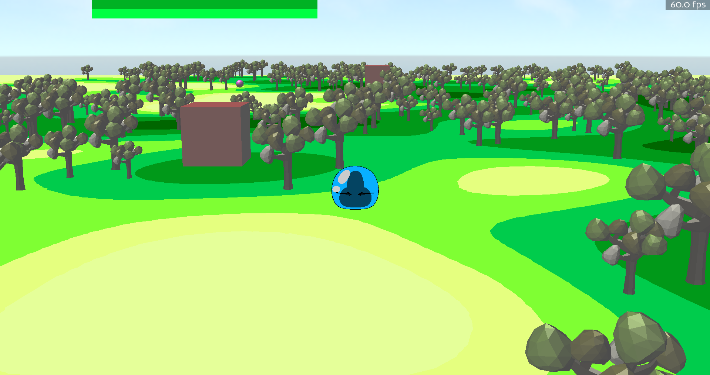
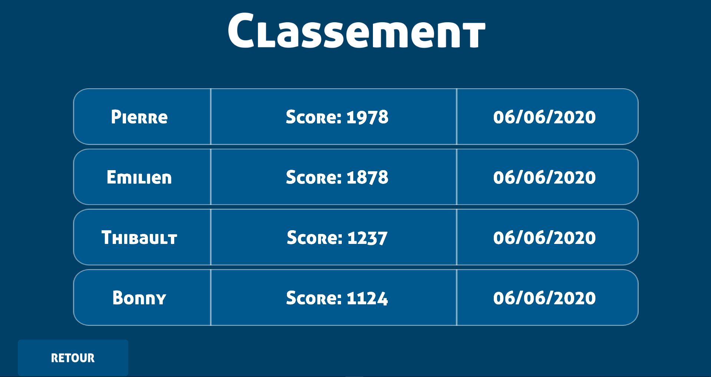

## V 0.10-alpha
 
A game created with python using panda3d.

## How to play

You control a slime and your goal is to finish the game with the biggest score.
For that you need to eat  as much slime as you can, but to eat them you need to be bigger than them.
On your way you will see some candy, that are represent with a sphere, those candy can grow you up but be carefull to don't eat too much candy :)
Some kamikaze represented by yellow cones will make your life a lot harder by rushing you to kill you !

### Controls

	z: walk forward
	s: walk backward
	d: strafe right
	q: strafe left
	space: jump
	a: shot projectile, you can charge this shot by holding down the key to make bigger and stronger shots
	e: dash
	
## Installation

### Window

You can download a .exe there: [download](https://github.com/iPazu/Slimy/releases/download/0.1/Slimy-0.1.zip)

#Mac

On mac you need to download the source code.
Once the files are downloaded you need to install some libraries. 
To do so run a terminal and type those commands: 
-run pip install panda3d==1.10.6
-pip install mysql-connector

Then you can open with python the main.py
To do so just open a terminal in the game folder and do the command python3 main.py

## Screenshots

## Known bugs and future !

The sounds are currently not working on windows, also the game needs to be more balanced.
Howewhere if you have any suggestion or find any bugs contact iPazu#9120 or Bronn#5790 on discord

This game was created for a project in college.
